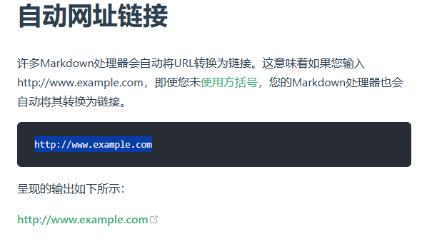

# [Markdown 基本语法](https://markdown.com.cn/)

---

- ## 标题（Heading）

    # H1
    ## H2
    ### H3

- ## 粗体（Bold）

    **bold text**

- ## 斜体（Italic）

    *italicized text*

- ## 引用块（Blockquote）

    > blockquote

- ## 有序列表（Ordered List）

    1. First item
    2. Second item
    3. Third item

- ## 无序列表（Unordered List）

    - First item
    - Second item
    - Third item

- ## 代码（Code）

    `code`

- ## 分隔线（Horizontal Rule）

    ---

- ## 链接（Link）

    [title](https://www.example.com)

- ## 图片（Image）

    

---

# 扩展语法

- ## 表格（Table）

    | Syntax      | Description |
    | :---------  | :---------: |
    | Header      | Title       |
    | Paragraph   | Text        |

- ## 代码块（Fenced Code Block）

    ```json
    {
    "firstName": "John",
    "lastName": "Smith",
    "age": 25
    }
    ```

- ## 脚注（Footnote）

    Here's a sentence with a footnote. [^1]
    [^1]: This is the footnote.

    Here's a sentence with a footnote. [^2]
    [^2]: This is the footnote too.

- ## 标题编号（Heading ID）

    ### My Great Heading {#custom-id}

- ## 定义列表（Definition List）

    term
    : definition

- ## 删除线（Strikethrough）

    ~~The world is flat.~~

- ## 任务列表（Task List）

    - [x] Write the press release
    - [ ] Update the website
    - [ ] Contact the media

- ## 使用 Emoji 表情

    去露营了！ :tent: 很快回来。

    真好笑！ :joy:

- ## 以上